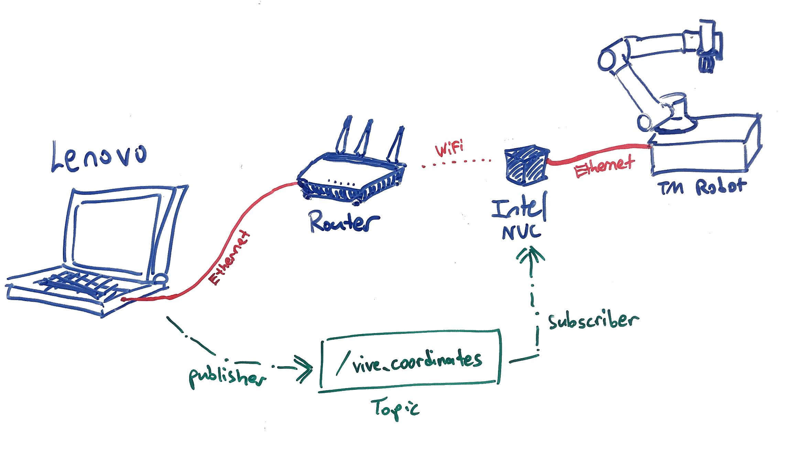

= Vive-TM Experimentation
:site-section: Documentation
:toc:
:toclevels: 3
:toc-title: Table of Contents
:toc-placement: preamble
:icons: font
:sectnums:
:imagesDir: .
:librariesDir: 
:stylesDir: stylesheets
:xrefstyle: full
:experimental:
:linkattrs:
ifdef::env-github[]
:tip-caption: :bulb:
:note-caption: :information_source:
:warning-caption: :warning:
endif::[]

:url-repo: https://github.com/guanyewtan/Omron_TM_ROS2
:url-ug: https://github.com/guanyewtan/Omron_TM_ROS2

By: `Tan Guan Yew`(link:https://github.com/guanyewtan[guanyewtan])

== About

*THIS PROJECT IS NOT RELATED TO THE PICKPLACE PROGRAM!*

This folder contains the files used in the testing of running ROS2 across multiple machine.
Use case: Controlling the TM arm using a Vive controller.

== Overview
=== Hardware Setup
.Overview of setup

The figure above shows the hardware setup used for the experiment: 

. A Lenovo laptop (running Ubuntu 20.04) connected via ethernet cable to a router

. An Intel NUC8i5BEH connected via ethernet cable to a TM robot

. The Intel NUC8i5BEH is connected via WiFi to the router

=== Software Prerequisites

. **Ubuntu 20.04 LTS (Focal Fossa)**
+
See link:https://ubuntu.com/download/desktop[Ubuntu] webpage for installation instructions (version 20.04 release).
+
Both the Lenovo and Intel NUC computers are running the Ubuntu 20.04 OS, as they will be running ROS 2 (more details on ROS 2 below)

. **Robot Operating System 2 (ROS 2) Foxy Fitzroy Release**
+
Download and installation instructions can be found link:https://docs.ros.org/en/foxy/Installation/Linux-Install-Debians.html[here].
+
[NOTE]
Installing via the Ubuntu terminal and debian packages is the most convenient way to install ROS 2.
+
The scripts were developed using ROS 2. A key feature to note is that ROS 2 does not use `ROS Master` to locate nodes.
+
This guide assumes you know the basics of using the ROS 2 environment. If you are new to ROS 2, please follow their series of link:https://docs.ros.org/en/foxy/Tutorials.html[tutorials] to get started with using ROS 2.
+
You will need to complete at least the `Beginner Level` tutorials. 

. **Python 3**
+
The python scripts are developed and written in link:https://www.python.org/downloads/release/python-385/[Python 3.8.5].
3/tutorial/classes.html[here].

. **TMflow v1.82.3400**
+
The TM set up instructions here assumes you are using `TMflow v1.82.3400` to set up the listen node (as well as other nodes). The packages are also compatible with TMflow v1.80.5300. Other versions have not been tested.

. **Pymodbus**
+
Modbus communication is used alongside the TM drivers to obtain robot parameters, and is also capable of controlling many of the TM robot's features. Documenttion for Pymodbus can be found link:https://pymodbus.readthedocs.io/en/latest/readme.html[here].

== Software Design

The idea is to publish the vive coordinates to a topic, which will be subscribed to by a listener node running on another computer connected to the TM arm. The computer will then send the commands to the TM arm using the TM driver's functionalities.

The 2 main scripts responsible for the demonstration are `movepublisher.py` and `movesubscriber.py`.

=== TMflow Program

In TMflow, create a flow project, then choose the __Listen__ node.

.Project Flow
image::ProjectFlow.png[]

=== TM System/Network Setup
. Go to System -> Network setting page and enter the network parameters of the robot
+
.Network Parameters
image::NetworkSetup.png[]
. Go to Setting -> Connection -> Ethernet Slave
+
Select the Data Table Setting button and check the following boxes (__make sure the Ethernet Slave is DISABLED or you will be unable to change the settings__):
+
 - [x] Robot_Error
 - [x] Project_Run
 - [x] Project_Pause
 - [x] Safeguard_A
 - [x] ESTOP
 - [x] Camera_Light
 - [x] Error_Code
 - [x] Joint_Angle
 - [x] Coord_Robot_Flange
 - [x] Coord_Robot_Tool
 - [x] TCP_Force
 - [x] TCP_Force3D
 - [x] TCP_Speed
 - [x] TCP_Speed3D
 - [x] Joint_Speed
 - [x] Joint_Torque
 - [x] Project_Speed
 - [x] MA_Mode
 - [x] Robot Light
 - [x] Ctrl_DO0~DO7
 - [x] Ctrl_DI0~DI7
 - [x] Ctrl_AO0
 - [x] Ctrl_AI0~AI1
 - [x] END_DO0~DO3
 - [x] END_DI0~DI2
 - [x] END_AI0
+

. Set the Data Format to __BINARY__ and press save.

==== TM Modbus Setup
. Go to Setting -> Connection -> Modbus
+
Ensure the TCP Modbus Slave is __ENABLED__
+
.Modbus
image::Modbus.png[]

== Implementation

=== movepublisher.py

The publisher, `movepublisher.py`, runs on the Lenovo laptop. It continuously cycles through and publishes coordinates from a text file __positions.txt__ to the topic `/vive_coordinates`. The publishing rate can be changed.

=== movesubscriber.py

The listener, `movesubscriber.py`, runs on the Intel NUC8i5BEH. It subscribes to the topic `/vive_coordinates` and sends the coordinates to the TM arm using the set_positions method found in the `Move` class.

The TM driver should be running together with this script and connected to the TM arm.

== Video Demonstration

video::vive_demo.mp4[]